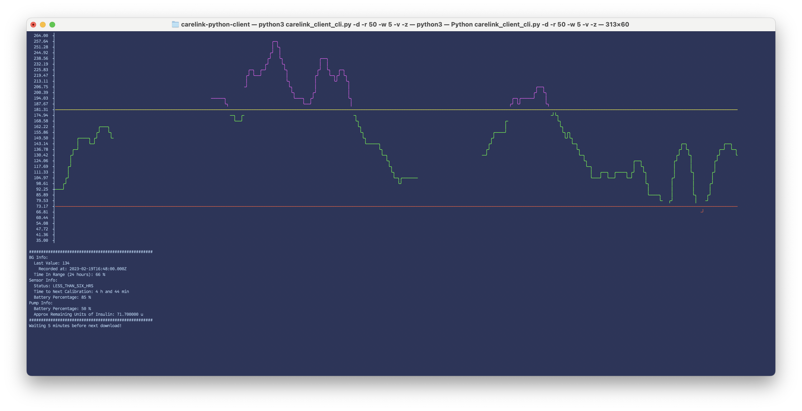

# Carelink Python Client
*Experimental Medtronic CareLink Client in Python*

Fork of the original put you can plot your data in the terminal! This just adds some simple plotting functionality so you can keep the plot open in the terminal and glance there for your BG info instead of you pump. Looks like this:

  

## Disclaimer

This project is intended for educational and informational purposes only. It relies on a series of fragile components and assumptions, any of which may break at any time. It is not FDA approved and should not be used to make medical decisions. It is neither affiliated with nor endorsed by Medtronic, and may violate their Terms of Service. Use of this code is without warranty or formal support of any kind.